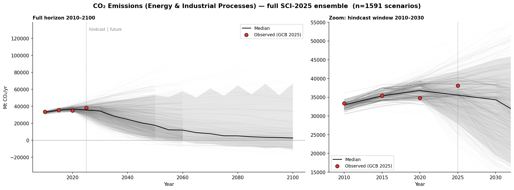
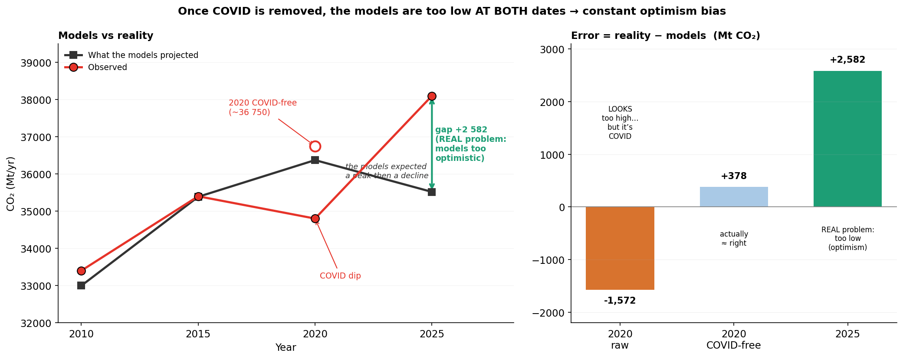
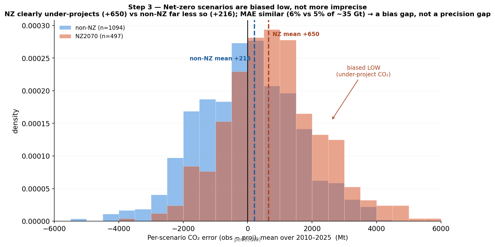
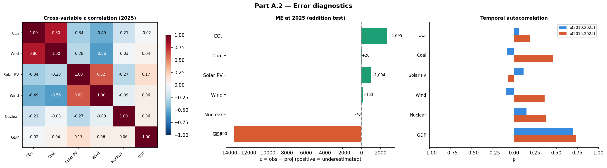
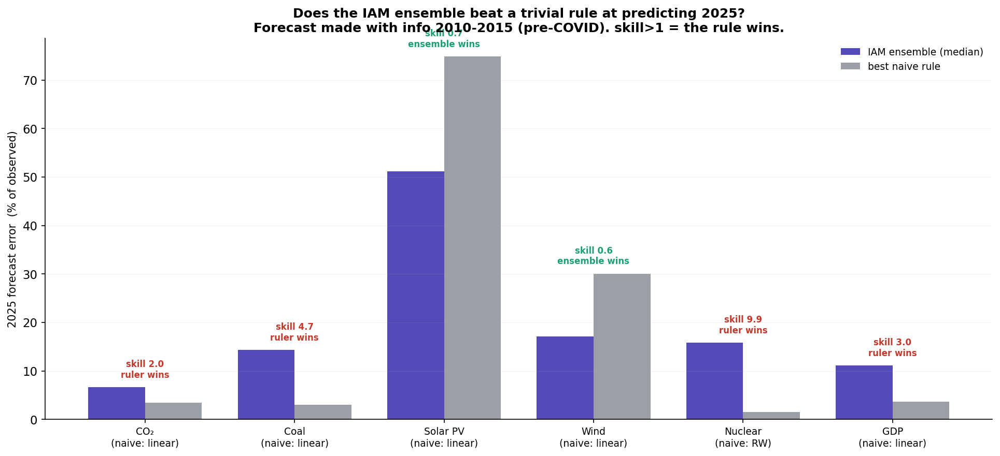
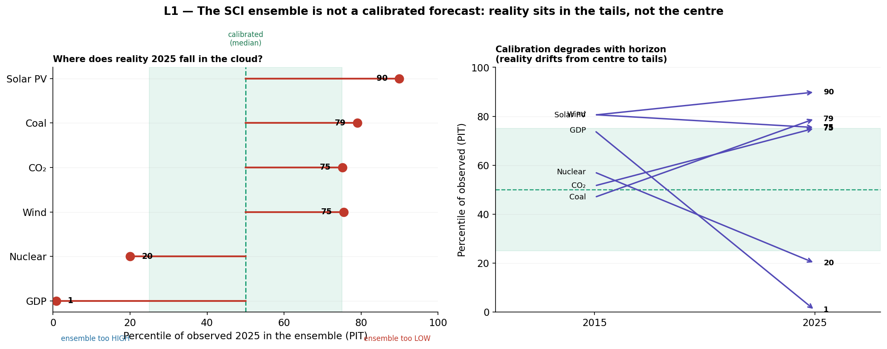
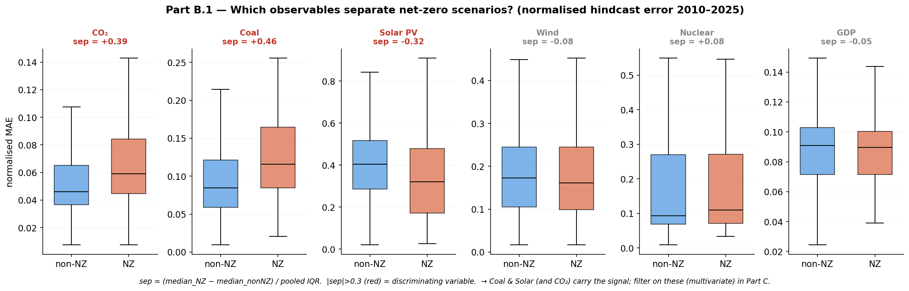
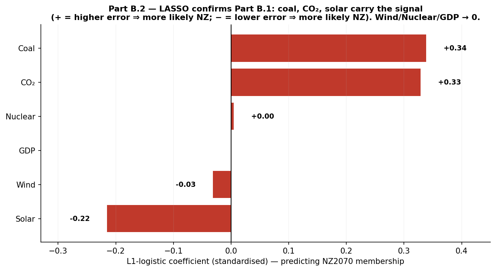
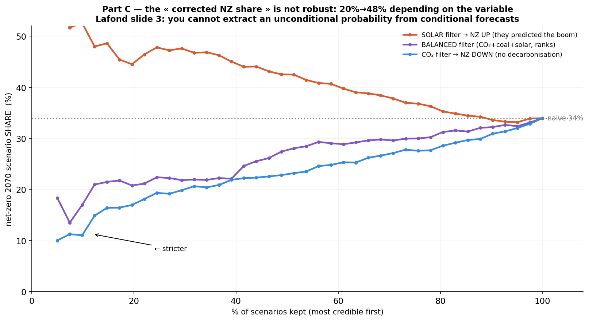
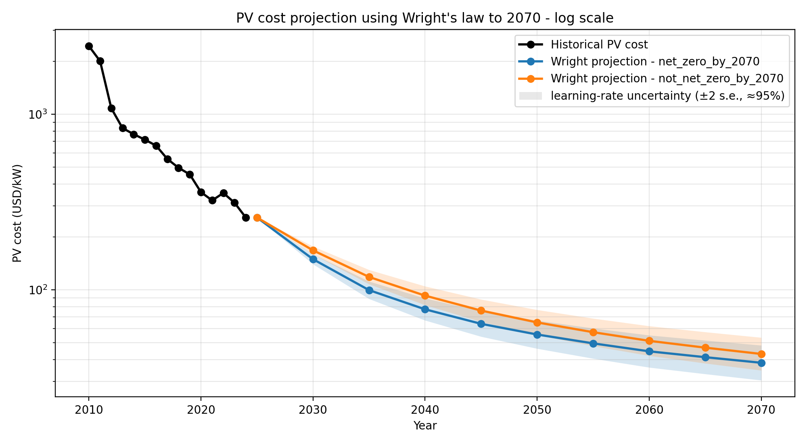

# Reaching net-zero CO₂ by 2070: what the scenario ensemble can and cannot tell us

*Output of work. Three parts — the question, the diagnosis (hindcast), and what can still be forecast.
Factual and explicit throughout (notation, metrics, and forecasting concepts spelled out), not a story.*

> **None of the shares in this document is an unconditional probability of reaching net-zero by 2070.**
> Each is a *conditional* sample frequency — a count over scenarios — reported as a sensitivity, not an
> estimate of how likely the world is to get there. This is a hindcast (a backtest on 2010–2025), not a
> true out-of-sample test: every pathway post-dates 2017.

## Framework & notation

Each scenario is treated as a **forecast object** and evaluated as a forecast: unbiased? calibrated?
better than a trivial rule?

- $`y`$ — observed value of a variable (CO₂, coal, solar, wind, nuclear, GDP) in a given year.
- $`\hat{y}`$ — a scenario's projection of the same thing.
- $`\varepsilon = y - \hat{y}`$ — forecast error. Positive $`\varepsilon`$ ⇒ the scenario projected too little.
- $`F`$ — the predictive distribution: the cloud of scenario values for a variable in a year.

Four concepts the project rests on:

1. **Conditional vs unconditional forecast.** A scenario gives $`\hat{y} = f(P)`$: the outcome *given* an
   assumed policy/technology path $`P`$. An unconditional forecast is the outcome marginally — a
   probability. One cannot obtain the second by counting the first.
2. **Origin × horizon.** A forecast made at origin $`t_0`$ looks out over horizon $`\tau`$. For a random walk
   with estimated drift, error variance grows as $`\sigma^2(\tau + \tau^2/m)`$ — long horizons are far less
   constrained than short ones.
3. **Calibration vs sharpness.** Calibrated ⇒ the PIT (the percentile at which $`y`$ falls in $`F`$) is
   uniform: reality near the median about half the time. Sharpness = interval width. A narrow
   interval reality keeps falling outside is overconfident.
4. **Skill vs a naive benchmark.** $`\text{skill} = |\varepsilon_{\text{model}}| / |\varepsilon_{\text{naive}}|`$; skill $`> 1`$ ⇒ the naive rule
   wins, i.e. the forecast adds nothing.

---

## Part 1 — The question

**Research question.** The SCI 2025 ensemble holds 1,564 pathways; 497 reach net-zero CO₂ by 2070, so
a naive $`P(\text{NZ2070}) = 497/1564 \approx 32\%`$. *Does the 2010–2025 record make that 32% meaningful?* This is a
cascade of nested questions (the A/B/C structure):

1. Is the ensemble a trustworthy forecast — unbiased, skilful, calibrated?
2. If we keep only credible scenarios, which variables define "credible", and how does the net-zero
   *share* move?
3. What can a 15-year record structurally not settle about a 45-year question?

**Method (Part 1):** a framing argument (conditional vs unconditional forecast) plus a
sensitivity check on the two arbitrary degrees of freedom hidden in the count.

**Why the 32% is not a probability — three points.**

*(1) What the number actually is.* We compute $`\hat{P}(\text{NZ2070}) = \frac{1}{J}\sum_{j} \mathbf{1}[\text{scenario } j \text{ reaches net-zero}]`$ —
the **frequency of net-zero pathways in this sample**. For a sample frequency to estimate a real
probability the sample must be (i) representative of what is being estimated and (ii) made of roughly
independent draws. The SCI ensemble is neither: it is a **convenience sample** — 63 models, the top
three contributing 28% of all runs, with heavily correlated scenarios (same models, reused
assumptions). The frequency therefore measures the *research agenda of the modelling teams*, not the
likelihood of the world.

*(2) It moves with the deadline (degree of freedom #1).* "Net-zero by 2070" hides a chosen cutoff:

| Reach net-zero by | 2060 | 2070 | 2080 | ≤2100 (ever) |
|---|---|---|---|---|
| Share | 16% | 31% | 43% | 57% |

*(3) It moves with the composition (degree of freedom #2).* The frequency also depends on how many
runs each team submitted. Re-weighting so each modelling **family** *(sampling-bias correction)*, or each **project**, counts once:

| Weighting | by scenario count | one vote / family | one vote / project |
|---|---|---|---|
| NZ2070 share | 31% | 24% | 39% |

Two choices that have nothing to do with the climate — the deadline and the weighting — each move the
number by roughly half (16–57%, 24–39%). A quantity that elastic is not a probability. Conceptually
this is inevitable: each pathway is a *conditional* forecast $`\hat{y} = f(P)`$ (emissions *given* an assumed
policy path $`P`$), not a draw from the distribution of futures, and counting conditional "if–then"
statements cannot produce an unconditional probability. So we stop trying to revise a number and
instead test the ensemble *as a forecast* (Part 2), reporting a sensitivity, not a probability.

---

## Part 2 — Diagnosis: is the ensemble a usable forecast?

*Research question: is the ensemble unbiased, skilful, and calibrated — and which variables carry
credibility signal? **Method: a hindcast (backtest).** Each scenario's projection is scored against
the observed 2010–2025 record (error $`\varepsilon = y - \hat{y}`$), then summarised by bias/accuracy metrics (§2.1–2.4), the addition signature (§2.5), error structure (§2.6),
skill against a naive rule (§2.7), PIT calibration (§2.8), variable selection (§2.9),
and credibility filtering (§2.10).*

**2.1 — Error series; the 2025 undershoot is structural.** The full ensemble (all 1,591 pathways
2010–2100, with the four observed points) and a zoom on the hindcast window:

$`\varepsilon = y - \hat{y}`$ on CO₂ (fossil + industry, Global Carbon Budget 2025; family-weighted mean):

| Year | $`y`$ | $`\hat{y}`$ | $`\varepsilon`$ |
|---|---|---|---|
| 2010 | 33,400 | 32,995 | +405 |
| 2015 | 35,400 | 35,385 | +15 |
| 2020 | 34,800 | 36,372 | **−1,572** |
| 2025 | 38,100 | 35,518 | **+2,582** |

The 2020 error is COVID: replacing the dipped 34,800 by a COVID-free interpolation (≈36,750) flips $`\varepsilon`$
to ≈ +378, so ~75% of the 2020 gap is the shock. The 2025 error is structural: 38,100 lies on the
pre-COVID trend (~39,400 extrapolated), so reality did not deviate — the ensemble did, by assuming a
peak-and-decline. The +2,582 survives every detrending.

**2.2 — Bias by outcome (NZ vs non-NZ).** Mean error ME = mean over years of $`\varepsilon`$, family-weighted: NZ2070 **+650** vs
non-NZ **+216**. (The non-NZ *level* is weighting-dependent — near 0 under scenario weighting — so we
read the **gap**, robust at +434/+837/+1,281 under family/scenario/project weighting.) The typical
magnitudes (MAE ≈ 6% vs 5%) are close: this is a **bias** (systematic direction), not imprecision. The gap is significant *(KS test, p < 10⁻¹⁶)*.
It is also partly definitional — reaching net-zero by 2070 forces an early downturn, so such pathways
must under-project a reality that did not turn.

**2.3 — Bias by model type (economy vs energy).** Classifying the 17 model families by economic structure — **economy**
(endogenous macro: REMIND, WITCH, AIM, GEM-E3, IMACLIM, EPPA, CGEM, MERGE; 8 families, 701
scenarios) vs **energy-system** (partial equilibrium, GDP exogenous: MESSAGE, IMAGE, POLES, COFFEE,
GCAM, TIAM, PROMETHEUS; 7 families, 883 scenarios):

| Class | ME (overall) | ME 2020 | ME 2025 |
|---|---|---|---|
| Economy | +613 | −1,264 | +2,717 |
| Energy | −41 | −2,164 | +2,541 |

Economy models carry a **persistent positive bias** (+613): they are structurally more optimistic
about decarbonisation at every date. Energy-system models are centred overall (−41) but miss the
COVID dip more severely (−2,164 vs −1,264) — their bottom-up engineering structure tracks technical
trajectories, not macro shocks. Both classes undershoot 2025 comparably (~+2,600): the post-COVID
rebound is a shared blind spot.

**2.4 — Vintage does not explain the bias.** Classifying scenarios by the date of the research
project that produced them — **early** (≤2017: SSP, ADVANCE, EMF30, EMF33; 289 scenarios), **mid**
(2018–2020: CD-LINKS, COMMIT, etc.; 232 scenarios), **late** (2021+: ENGAGE, NAVIGATE, NGFS, IAM
COMPACT; 1,070 scenarios):

| Vintage | MAE 2010 | ME 2025 |
|---|---|---|
| Early (≤2017) | 1,141 | +466 |
| Mid (2018–2020) | 800 | +2,840 |
| Late (2021+) | 685 | **+3,280** |

Recent scenarios calibrate better at their base year (MAE 2010: 685 vs 1,141) — but they had the
answer. The real test is 2025, the only year where all vintages project into the unknown, and there
the late scenarios are **more wrong** (+3,280 vs +466), despite having more information and a shorter
horizon. The explanation is not technical degradation but **policy optimism**: post-Paris, post-Green
Deal projects produced more ambitious decarbonisation scenarios that reality has not confirmed.

The NZ vs non-NZ gap persists within every vintage group (ME_j ≈ +800 for NZ vs ≈ 0 for non-NZ),
confirming the bias is structural and not an artefact of when scenarios were built.

**2.5 — The addition signature: fossil and renewable underestimated simultaneously.** Extending
beyond CO₂, the 2025 error across all six observed variables:

| Variable | Observed 2025 | Ensemble median | ME | Direction |
|---|---|---|---|---|
| CO₂ | 38,100 Mt | 35,559 Mt | +2,695 | **underestimated** |
| Coal | 164 EJ | 140 EJ | +26 | **underestimated** |
| Solar PV | 2,392 GW | 1,169 GW | +1,004 | **underestimated** |
| Wind | 1,291 GW | 1,069 GW | +153 | **underestimated** |
| Nuclear | 377 GW | 437 GW | −70 | overestimated |
| GDP PPP | 122,000 B$ | 135,538 B$ | −13,400 | overestimated |

The ensemble underestimates fossil **and** renewable deployment simultaneously: observed solar PV
capacity is **double** the ensemble median, yet coal also hit a record. This is **energy addition** —
the world adds renewables on top of persistent fossils rather than substituting. The cross-variable
error correlation *(Pearson, n ≈ 1,065)* confirms the mechanism: Corr($`\varepsilon_{\text{coal}}, \varepsilon_{\text{solar}}`$) = −0.28,
indicating models embed a substitution logic (more solar → less coal within a scenario). But the
*level* is wrong for both — reality sits in the high-coal, high-solar corner of the scenario cloud
where the negative correlation prevents the ensemble from reaching. The anti-correlation is stronger
for NZ scenarios (−0.30) than non-NZ (−0.17): net-zero pathways rely more heavily on the substitution
assumption.

Nuclear is overestimated (models expected expansion beyond the post-Fukushima stagnation) and GDP
even more so (−13,400 B$). Both are largely independent of the fossil-renewable axis (Corr ≈ 0.05).

**2.6 — Error structure: temporal autocorrelation.** Is the error fixed at the base year or does it
evolve? *(Pearson autocorrelation across scenarios)* We compute ρ($`\varepsilon_{2010}, \varepsilon_{2025}`$) across scenarios for each variable:

| Variable | ρ(2010, 2025) | Interpretation |
|---|---|---|
| CO₂ | +0.056 | ≈ 0: error evolves, not locked in |
| Coal | −0.080 | ≈ 0: same |
| Solar PV | +0.113 | weak |
| Wind | −0.091 | ≈ 0 |
| Nuclear | +0.146 | weak |
| **GDP** | **+0.701** | **strong: structural, persistent bias** |

For energy and emissions variables, errors are **non-persistent**: a scenario's accuracy in 2010 does
not predict its accuracy in 2025. The error comes from the trajectory assumptions (how fast things
change), not the initial calibration. For GDP, ρ = 0.70: the bias is locked in at the base year (GDP
is typically an exogenous input, not an endogenous outcome). Practical consequence: filtering on
base-year accuracy is uninformative for energy/emissions variables but meaningful for GDP.

**2.7 — Skill vs a naive rule (a corollary, not an independent test).** *Purpose: test whether the ensemble adds value over a trivial extrapolation — if not, it cannot be trusted as a forecast.* Forecasting 2025 from 2010–
2015 with a random walk or linear trend *(forecast skill ratio)*:

| Variable | $`\text{skill} = \lvert\varepsilon_{\text{ens}}\rvert/\lvert\varepsilon_{\text{rule}}\rvert`$ | % scenarios beaten |
|---|---|---|
| CO₂ | 2.0 | 81% |
| Coal | 4.7 | 91% |
| Nuclear | 9.9 | 95% |
| GDP | 3.0 | 77% |
| Solar PV | 0.7 | 6% |
| Wind | 0.6 | 34% |

The rule wins on 4/6. But this is **the same fact as §2.1–2.4**, not an independent leg: the rule
wins on CO₂/coal/GDP precisely because reality stayed on trend while the ensemble bet on a turn. And
nuclear's skill 9.9 is **hollow** — nuclear is flat (375→377 GW), so "nothing changes" wins by
construction. Honest statement: on the on-trend variables the ensemble shows no skill against a ruler.

**2.8 — Calibration (a diagnostic, not a formal test).** *Purpose: test whether the ensemble is a well-calibrated probability distribution — if not, one cannot read P(NZ2070) from it.* Percentile of observed 2025 *(PIT — probability integral transform)* in $`F`$:

| GDP | Nuclear | CO₂ | Wind | Coal | Solar PV |
|---|---|---|---|---|---|
| 1st | 20th | 75th | 75th | 79th | 90th |

Reality sits **high** in the cloud for the carbon-relevant variables: the ensemble projected **too
little** CO₂ (75th), coal (79th) and even solar (90th); only GDP (1st) and nuclear (20th) come in low.
This is the calibration face of the §2.2–2.4 low bias — the ensemble under-shoots emissions. We do not
overstate it: 75th–79th is the upper-middle, **not a tail** — only GDP (1st) and solar (90th) are true
tails. And with **one point per variable** this is a suggestive diagnostic, not a formal PIT test.
What is solid is the *direction*: reality is rarely near the median ⇒ $`F`$ is not a clean distribution
to read $`P(\text{NZ2070})`$ from.

**2.9 — Variable selection (Part B).** Separation score *(normalised effect size, akin to Cohen's d)* $`\text{sep} = (\text{median}_{\text{NZ}} - \text{median}_{\text{non-NZ}})/\text{IQR}`$ per
variable: **Coal +0.46, CO₂ +0.39, Solar −0.32** discriminate; Wind, Nuclear, GDP ≈ 0 do not. The
three informative variables **disagree in sign**: NZ worse on coal/CO₂, better on solar (the addition
signature at the level of credibility).

**LASSO confirmation.** To verify this is not an artefact of the box-plot method, we run an
L1-penalised logistic regression *(probabilistic classification model)* predicting NZ membership from each scenario's normalised MAE on the
six variables (standardised so coefficients are comparable). The L1 penalty forces uninformative
coefficients to exactly zero — only variables that genuinely help predict NZ status survive.

At regularisation strength C = 0.1:

| Variable | LASSO coefficient | Interpretation |
|---|---|---|
| Coal | **+0.34** | Higher coal error → more likely NZ |
| CO₂ | **+0.22** | Higher CO₂ error → more likely NZ |
| Solar | **−0.18** | Lower solar error → more likely NZ |
| Wind | 0 | dropped |
| Nuclear | 0 | dropped |
| GDP | 0 | dropped |

The LASSO selects the **same three variables with the same signs** as the box plots — and kills the
other three. This holds across a range of regularisation strengths (C = 0.05 to 0.3). The result is
not circular: the target (NZ status) is distinct from the predictors (hindcast errors), and the
penalty prevents overfitting.

Consequence: filter on coal + CO₂ + solar jointly — CO₂ alone is a trap (by the Kaya identity, its
GDP and carbon-intensity errors partly cancel, so a scenario can land on the right CO₂ for the wrong
reasons).

**2.10 — Filtering (Part C): ~20%, not "anything".** Keeping the 25% most accurate and recomputing the
net-zero share: **CO₂ → 20%, multivariate → 22%, solar-only → 48%** (naive 34%). So conditioning on
sensible accuracy criteria yields shares **near 20%**; it rises to 48% only under solar-only filtering,
a poor criterion since solar is the variable everyone misses. The robust result is the *directional*
dependence on the conditioning variable — the empirical proof of Part 1 (no single unconditional
probability exists). We label this object the **sensitivity of the net-zero share**, not a revised
probability.

---

## Part 3 — What can still be forecast

*Research question: if the ensemble is unreliable, what can we forecast honestly — and where is the
real constraint on net-zero? **Method:** forecast-horizon limits (§3.1), an independent
experience-curve forecast (Wright's law) for technology cost (§3.2), reconciled through the
addition/substitution structure (§3.3).*

**3.1 — The structural limit.** A 15-year backtest cannot settle a 45-year question (error variance
$`\propto \tau + \tau^2/m`$). A pathway flat until ~2030 then crashing to net-zero is indistinguishable from non-NZ
over 2010–2025, so filtering cannot go below the late-mover share (~20% as a practical floor;
unidentifiable by construction). And every scenario is post-2017, so this is a hindcast, not a true
out-of-sample test — the AR5 vintage (~2014 forecasting 2025) would provide one but is absent here.

**3.2 — The one quantity with skill: cost (Wright's law).** Solar PV cost fell ~2,440 → ~250 USD/kW
(2010→2024); a log-log experience-curve fit *(Wright's law — probabilistic technology forecasting)* (learning rate ≈ 0.39, i.e. cost falls ~39% per doubling
of capacity) projects ~38 USD/kW by 2070 for net-zero pathways and ~43 for non-net-zero ones. The two
projections are nearly identical — clean tech becomes cheap whether or not the world reaches net-zero.

The shaded band is a **±2 s.e. (≈95%) learning-rate uncertainty**, propagated from the standard error
of the fitted exponent through the projection. Even at its edges the net-zero and non-net-zero bands
overlap, so the "NZ ≈ non-NZ" reading is robust to learning-rate uncertainty. *Two caveats we hold
ourselves to:* the band reflects only the learning-rate fit (estimated on few overlapping points), not
trajectory or model uncertainty; and Wright's law is hard to prove strictly superior to a time-trend,
so this is the policy-relevant lens, not a proven point forecast.

**3.3 — Reconciliation: the lock is substitution, not cost.** Part 2 (ensemble too optimistic) and
§3.2 (clean tech cheaper than assumed) only seem to conflict. The world does two things at once:
deploys renewables faster than any model (costs fall faster — §3.2) *and* keeps the fossils
(emissions rise — Part 2). So the binding constraint on net-zero is **not primarily the cost of clean
generation** — that is outperforming the scenarios; system costs (grids, storage, capital, permitting)
still shape the *rate* — it is **substitution**: clean is added without removing dirty.
The net-zero scenarios miss reality not because their technology optimism is wrong but because they
assume a fossil phase-out that is not happening.

**Conclusion.** None of this forecloses net-zero by 2070; it **relocates the constraint**. The naive
32% is not a probability; the record gives **no support** for reading the count as an unconditional
probability; the conditional share sits near 20% under sensible filtering but cannot be sharpened
further. The door to 2070 is opened by cheap clean technology and held shut by fossil inertia — the
decisive variable is substitution (policy and system inertia), not generation cost.

### Statistical and probabilistic methods used

- Bias estimation: ME, MAE, RMSE (§2.1)
- Hypothesis testing: KS test for NZ vs non-NZ separation (§2.2)
- Sampling-bias correction: family weighting 1/n_f (§2.1–2.10)
- Cross-variable correlation: Pearson (§2.5)
- Temporal autocorrelation: Pearson across scenarios (§2.6)
- Forecast skill ratio vs naive benchmark (§2.7)
- Calibration diagnostic: PIT percentile (§2.8)
- Normalised effect size (sep, akin to Cohen's d) for variable selection (§2.9)
- L1-penalised logistic regression (LASSO) for probabilistic classification (§2.9)
- Wright's law: OLS experience-curve fit with ±2 s.e. prediction band (§3.2)
