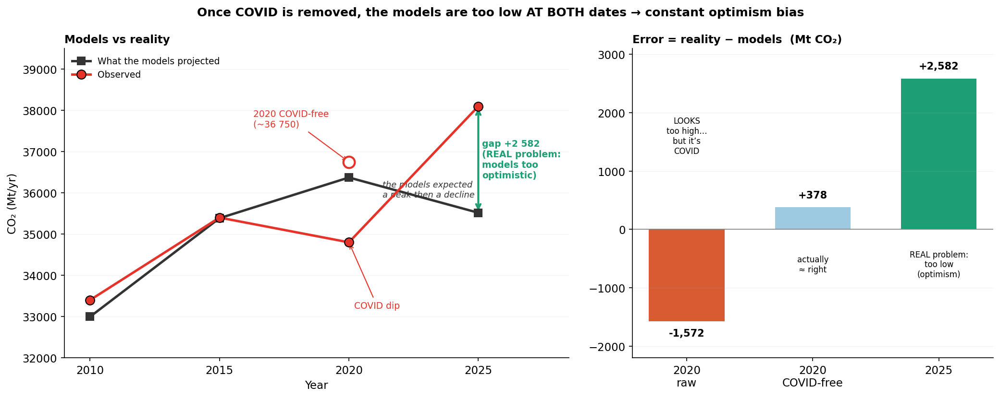
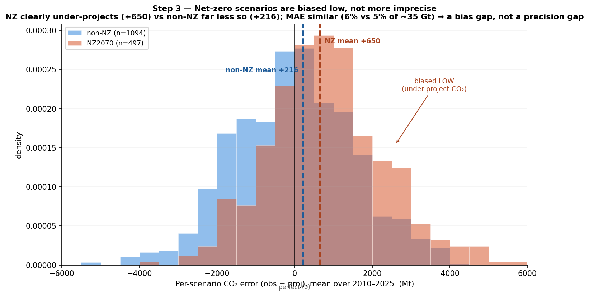
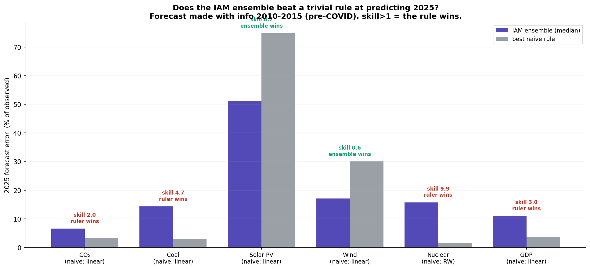
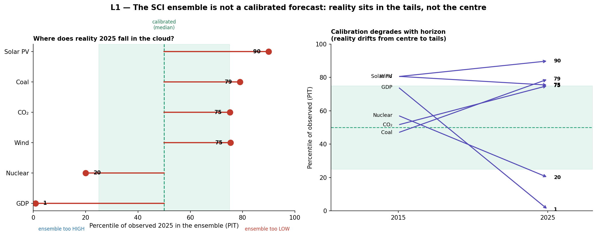
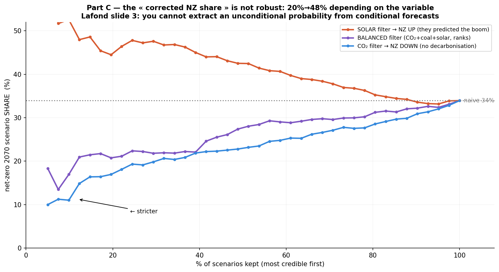

# Narrative

*Built step by step. One step = one result, stated simply.*

## Research question

The SCI 2025 ensemble holds 1,564 model pathways; 497 reach net-zero CO₂ by 2070 — read
naively, a ~32% "chance" of net-zero by 2070.

**Is that 32% meaningful — and what happens to it once we confront the scenarios with what
actually happened over 2010–2025?**

## Step 1 — The naive 32% is not a probability

**Conceptual.** An IAM scenario is a *conditional* forecast — "*if* policy follows this path,
*then* emissions follow that one." It is not a draw from a distribution of possible futures.
Counting how many "if–then" pathways end in net-zero measures the menu modelling teams chose to
run, not the chance the world gets there.

**Empirical.** The number is not even stable. "Net-zero by 2070" hides an arbitrary deadline:

| Net-zero reached by | Pathways | Share |
|---|---|---|
| 2060 | 256 | 16% |
| 2070 | 497 | 31% |
| 2080 | 688 | 43% |
| any time (≤2100) | 909 | 57% |

Slide the deadline by a decade and the "probability" doubles. A number that depends that much on
its own definition is not a probability.

**So we pivot.** We do not revise a probability. We ask two honest questions:

1. Is the ensemble a usable, well-calibrated forecast?
2. How does conditioning on historical accuracy move the net-zero *share*?

---

## Step 2 — The hindcast: the ensemble undershoots 2025 (structural, not COVID)

We compare the ensemble's CO₂ projection to observed reality at the 4 points 2010→2025.
Error = observed − projected (**positive = the models aimed too low**).

The full ensemble — all CO₂ trajectories (2010–2100) with the 4 observed points (context):

| Year | Observed | Projected (mean) | Error |
|---|---|---|---|
| 2010 | 33,400 | 32,995 | +405 |
| 2015 | 35,400 | 35,385 | +15 |
| 2020 | 34,800 | 36,372 | **−1,572** |
| 2025 | 38,100 | 35,518 | **+2,582** |

Through 2015 the ensemble is near-perfect. Then two errors appear — and they are **two different
stories**:

- **2020 (−1,572, models too high) = COVID.** Lockdowns crashed emissions. Remove the dip
  (interpolate 2015→2025) and the error flips sign (≈ +378): without COVID the models were nearly
  spot-on. So ~75% of the 2020 gap is COVID, not model failure.
- **2025 (+2,582, models too low) = structural.** No COVID to remove here: by 2025 emissions had
  recovered, and 38,100 sits right on the pre-COVID trend (~39,400 extrapolated). The ensemble did
  not miss a shock — it assumed a peak-and-decline that never came. **Structural optimism.**

The models' median peaks ~2020 then falls; reality dips (COVID) then rises — they diverge in
opposite directions after 2020.

**This +2,582 is the load-bearing number:** it survives every detrending, and it says the
ensemble is biased low.

---

## Step 3 — The net-zero scenarios are the ones most biased low

Split the ensemble into **NZ2070** (the 497 that reach net-zero by 2070) and **non-NZ**.
Their mean CO₂ error over 2010–2025 (family-weighted):

| Group | Mean error (ME) | MAE |
|---|---|---|
| **NZ2070** | **+650** (under-project) | 2,147 (~6%) |
| **non-NZ** | **+216** (far less) | 1,649 (~5%) |

NZ scenarios systematically project less CO₂ than reality — they assumed faster decarbonization
than happened. The gap holds under every weighting (+434 family, +837 scenario, +1,281 project).

Three things to keep honest:

- **It is a bias, not imprecision.** The error *magnitude* (MAE) is similar (~6% vs ~5%). What
  separates the groups is the *direction* (NZ always too low), not the size.
- **It is partly tautological.** To reach net-zero by 2070 a pathway must bend emissions down
  early; reality did not; so an NZ pathway under-projects 2025 *by construction*. And a pathway
  that decarbonizes late (after ~2030) is indistinguishable from non-NZ over 2010–2025 — the
  hindcast only catches early movers.
- **It is robust** to how we weight (scenario / family / project).

**Defensible claim** (not "net-zero models are wrong"):

> Pathways premised on an early turn — which has not begun — are now the least consistent with
> observation.

---

## Step 4 — Does the ensemble forecast at all? A trivial rule beats it

A forecast earns trust only by beating a trivial rule. The test: standing in 2015, using only
2010+2015, predict 2025 with a trivial rule (random walk / linear trend) vs the ensemble (median
of the scenarios). `skill = |ensemble error| / |rule error|` — **skill > 1 means the rule wins.**
"% beaten" = share of individual scenarios worse than the rule.

| Variable | Ensemble error | Rule error | skill | % scenarios beaten |
|---|---|---|---|---|
| **CO₂** | 7% | 3% | **2.0** | **81%** |
| **Coal** | 14% | 3% | **4.7** | **91%** |
| **Nuclear** | 16% | 2% | **9.9** | **95%** |
| **GDP** | 11% | 4% | **3.0** | **77%** |
| Solar PV | 51% | 75% | 0.7 | 6% |
| Wind | 17% | 30% | 0.6 | 34% |

For **4 of 6 variables a 2-point rule beats the whole IAM ensemble** — on nuclear, 95% of
scenarios are beaten by "nothing changes".

The ensemble *wins* only on solar and wind — but it is still massively wrong there (51% off on
PV). So this is not "the ensemble is good on renewables"; it is "everyone misses PV, and the linear
rule misses it even more". That is exactly where a dedicated method is needed (Wright's law, ahead).

*Caveats*: a single target year (2025), so "% beaten" is the robust statistic, not skill on one
point; the rule is trained on only 2 points.

**What it means:** an ensemble that a 2-point rule outperforms on 4 of 6 variables has not
demonstrated forecasting skill — and the net-zero share it implies inherits that weakness.

---

## Step 5 — The ensemble is not even calibrated as a distribution

Step 4 showed the point forecast (the median) is bad. But an ensemble is a range, not a point — is
it at least honest as a *distribution*? No.

**The calibration test (PIT).** For each variable, where does observed 2025 fall in the scenario
cloud (its percentile)? A calibrated forecast would put reality near the median (~50th) about half
the time, scattered uniformly. If it sits in the **tails**, the ensemble is biased *and* overconfident.

| Variable | Percentile of observed 2025 | Reading |
|---|---|---|
| **GDP** | **1st** | ensemble far too high |
| Nuclear | 20th | too high |
| CO₂ | 75th | too low |
| Wind | 75th | too low |
| Coal | 79th | too low |
| **Solar PV** | **90th** | far too low |

For all 6 variables reality lands in the **tails, never the centre** — GDP below 99% of scenarios.
And calibration **degrades with horizon**: at 2015 several variables were near the centre (CO₂ at
the 52nd); by 2025 they have drifted to the edges.

This is the **probabilistic version** of the bias: Step 4 said the median is wrong; Step 5 says the
*whole distribution* is mis-calibrated — biased and overconfident. It closes the loop with Step 1:
an ensemble whose reality lands at the 90th or 1st percentile is **not a probability distribution**
of futures, so no "P(net-zero)" can be read from it. Calibration, not MAE, is what reveals this.

---

## Step 6 — Part B: which variables carry the signal?

To filter scenarios by credibility we must know which variables actually separate good from bad
pathways. For each variable we compare the hindcast error of **NZ vs non-NZ** scenarios (box plots).
Clear separation → the variable carries signal; overlap → it does not.
Score: `sep = (median_NZ − median_nonNZ) / IQR`.

| Variable | sep | Discriminating? | Direction |
|---|---|---|---|
| **Coal** | **+0.46** | ✅ | NZ worse |
| **CO₂** | **+0.39** | ✅ | NZ worse |
| **Solar** | **−0.32** | ✅ | NZ better |
| Wind | −0.08 | ❌ | — |
| Nuclear | +0.08 | ❌ | — |
| GDP | −0.05 | ❌ | — |

Three variables carry the signal — **coal, CO₂, solar**. The other three separate nothing.

**The crucial twist:** the *sign* disagrees. On CO₂ and coal the NZ scenarios are *worse* (they
assumed a decline that did not happen); on solar they are *better* (they predicted the boom). The
discriminating variables contradict each other — the "addition" signature at the credibility level.

This dictates Part C:

1. **Filter multivariate (coal + solar + CO₂)**, not CO₂ alone — CO₂ alone is a trap (Kaya: its
   GDP/intensity errors cancel).
2. Because the informative variables disagree, the filtered result depends on which you weight —
   exactly what flips Part C.

No LASSO or PCA needed: Part B reduces to "coal, CO₂ and solar carry the signal; filter on them,
multivariate."

---

## Step 7 — Part C: the result (filtering gives no number)

The original goal: keep the credible scenarios, recompute the net-zero share, get a corrected
number. **There is no single corrected number.**

We keep the scenarios most accurate over 2010–2025 and recompute the net-zero share among them —
varying how strict we are and which variable judges accuracy. The share moves in **opposite
directions** depending on the credibility variable (naive ≈ 34%):

| Keep the 25% most accurate on… | Net-zero share |
|---|---|
| **CO₂** | **~20%** ⬇️ |
| multivariate (CO₂+coal+solar) | ~22% ⬇️ |
| **Solar** | **~48%** ⬆️ |

The "corrected" share can be **anything between 20% and 48%**, around the naive 34%, under a
perfectly defensible choice of variable.

**Why (the Step 6 mechanism):** NZ scenarios were right on solar (the boom) and wrong on CO₂/coal
(no decline). Filter on what they missed (CO₂/coal) → they are removed → the share falls. Filter on
what they got right (solar) → they are kept → the share rises.

**The conclusion — it closes the loop.** There is no single corrected net-zero share, and this
non-robustness **is** the result: the empirical proof of Step 1. You cannot extract an unconditional
probability from conditional forecasts — because the answer depends on the conditioning variable you
pick. So we relabel the object: not "the revised probability" but **"the sensitivity of the net-zero
share"**. The starting tension is no longer a problem — it has become the result.

---

*Next: Step 8 — the honest limit (what a 15-year hindcast cannot settle).*
