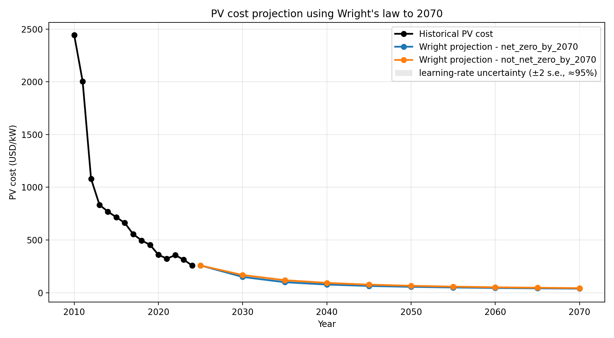

# Narrative — formal version

*Three parts — the question, the diagnosis, what can still be forecast. Kept factual and explicit
(notation, metrics, forecasting concepts spelled out), not a story. Oversold claims deflated.*

## Framework & notation

Each scenario is treated as a **forecast object** and evaluated as a forecast: unbiased? calibrated?
better than a trivial rule?

- **y** — observed value of a variable (CO₂, coal, solar, wind, nuclear, GDP) in a given year.
- **ŷ** — a scenario's projection of the same thing.
- **ε = y − ŷ** — forecast error. Positive ε ⇒ the scenario projected too little.
- **F** — the predictive distribution: the cloud of scenario values for a variable in a year.

Four concepts the project rests on:

1. **Conditional vs unconditional forecast.** A scenario gives ŷ = f(P): the outcome *given* an
   assumed policy/technology path P. An unconditional forecast is the outcome marginally — a
   probability. One cannot obtain the second by counting the first.
2. **Origin × horizon.** A forecast made at origin t₀ looks out over horizon τ. For a random walk
   with estimated drift, error variance grows as **σ²·(τ + τ²/m)** — long horizons are far less
   constrained than short ones.
3. **Calibration vs sharpness.** Calibrated ⇒ the PIT (the percentile at which y falls in F) is
   uniform: reality near the median about half the time. Sharpness = interval width. A narrow
   interval reality keeps falling outside is overconfident.
4. **Skill vs a naive benchmark.** skill = |ε(model)| / |ε(naive rule)|; skill > 1 ⇒ the naive rule
   wins, i.e. the forecast adds nothing.

---

## Part 1 — The question

**Research question.** The SCI 2025 ensemble holds 1,564 pathways; 497 reach net-zero CO₂ by 2070, so
a naive P(NZ2070) = 497/1564 ≈ 32%. *Does the 2010–2025 record make that 32% meaningful?* This is a
cascade of nested questions (the A/B/C structure):

1. Is the ensemble a trustworthy forecast — unbiased, skilful, calibrated?
2. If we keep only credible scenarios, which variables define "credible", and how does the net-zero
   *share* move?
3. What can a 15-year record structurally not settle about a 45-year question?

**Method (Part 1):** a framing analysis (conditional vs unconditional forecast) and a
threshold-sensitivity check on the definition of "net-zero".

**Why the 32% is not a probability.** Conceptually, the 497 are conditional forecasts ŷ = f(P) whose
assumed paths P end at zero — the menu of runs, not the likelihood of the world. Empirically, the
count is unstable: "net-zero by 2070" hides an arbitrary deadline, and sliding it moves the share by
a factor of three:

| Net-zero reached by | Pathways | Share |
|---|---|---|
| 2060 | 256 | 16% |
| 2070 | 497 | 31% |
| 2080 | 688 | 43% |
| ≤2100 (ever) | 909 | 57% |

A quantity that runs 16%→57% with its own definition is not a probability. We therefore test the
ensemble *as a forecast* (Part 2) and report a sensitivity, not a probability (end of Part 2).

---

## Part 2 — Diagnosis: is the ensemble a usable forecast?

*Research question: is the ensemble unbiased, skilful, and calibrated — and which variables carry
credibility signal? **Method: a hindcast (backtest).** Each scenario's projection is scored against
the observed 2010–2025 record (error ε = y − ŷ), then summarised by bias/accuracy metrics (§2.1–2.2),
skill against a naive rule (§2.3), PIT calibration (§2.4), box-plot/LASSO variable selection (§2.5),
and credibility filtering (§2.6).*

**2.1 — Error series; the 2025 undershoot is structural.** The full ensemble (all 1,591 pathways
2010–2100, with the four observed points) and a zoom on the hindcast window:

ε = y − ŷ on CO₂ (family-weighted mean):

| Year | y | ŷ | ε |
|---|---|---|---|
| 2010 | 33,400 | 32,995 | +405 |
| 2015 | 35,400 | 35,385 | +15 |
| 2020 | 34,800 | 36,372 | **−1,572** |
| 2025 | 38,100 | 35,518 | **+2,582** |

The 2020 error is COVID: replacing the dipped 34,800 by a COVID-free interpolation (≈36,750) flips ε
to ≈ +378, so ~75% of the 2020 gap is the shock. The 2025 error is structural: 38,100 lies on the
pre-COVID trend (~39,400 extrapolated), so reality did not deviate — the ensemble did, by assuming a
peak-and-decline. The +2,582 survives every detrending.

**2.2 — Bias by outcome.** Mean error ME = mean over years of ε, family-weighted: NZ2070 **+650** vs
non-NZ **+216**. (The non-NZ *level* is weighting-dependent — near 0 under scenario weighting — so we
read the **gap**, robust at +434/+837/+1,281 under family/scenario/project weighting.) The typical
magnitudes (MAE ≈ 6% vs 5%) are close: this is a **bias** (systematic direction), not imprecision.
It is also partly definitional — reaching net-zero by 2070 forces an early downturn, so such pathways
must under-project a reality that did not turn.

**2.3 — Skill vs a naive rule (a corollary, not an independent test).** Forecasting 2025 from 2010–
2015 with a random walk or linear trend:

| Variable | skill = \|ε_ens\|/\|ε_rule\| | % scenarios beaten |
|---|---|---|
| CO₂ | 2.0 | 81% |
| Coal | 4.7 | 91% |
| Nuclear | 9.9 | 95% |
| GDP | 3.0 | 77% |
| Solar PV | 0.7 | 6% |
| Wind | 0.6 | 34% |

The rule wins on 4/6. But this is **the same fact as §2.1–2.2**, not an independent leg: the rule
wins on CO₂/coal/GDP precisely because reality stayed on trend while the ensemble bet on a turn. And
nuclear's skill 9.9 is **hollow** — nuclear is flat (375→377 GW), so "nothing changes" wins by
construction. Honest statement: on the on-trend variables the ensemble shows no skill against a ruler.

**2.4 — Calibration (a diagnostic, not a formal test).** Percentile of observed 2025 in F:

| GDP | Nuclear | CO₂ | Wind | Coal | Solar PV |
|---|---|---|---|---|---|
| 1st | 20th | 75th | 75th | 79th | 90th |

Reality is **systematically on the low-emissions side**. We do not overstate it: 75th–79th is the
upper-middle, **not a tail** — only GDP (1st) and solar (90th) are true tails. And with **one point
per variable** this is a suggestive diagnostic of low bias, not a formal PIT test (which needs many
origins × targets). "Overconfident" is firm only for solar and GDP. What is solid is the *direction*:
reality off-centre low ⇒ F is not a clean distribution to read P(NZ2070) from.

**2.5 — Variable selection (Part B).** Separation score sep = (median_NZ − median_non-NZ)/IQR per
variable: **Coal +0.46, CO₂ +0.39, Solar −0.32** discriminate; Wind, Nuclear, GDP ≈ 0 do not. The
three informative variables **disagree in sign**: NZ worse on coal/CO₂, better on solar (the addition
signature). An L1-LASSO predicting NZ from the errors selects the same three with the same signs.
Consequence: filter on coal+CO₂+solar jointly — CO₂ alone is a trap (its GDP/intensity errors cancel).

**2.6 — Filtering (Part C): ~20%, not "anything".** Keeping the 25% most accurate and recomputing the
net-zero share: **CO₂ → 20%, multivariate → 22%, solar-only → 48%** (naive 34%). So the corrected
share is **~20% under any reasonable filter**; it rises to 48% only under solar-only filtering, a poor
criterion since solar is the variable everyone misses. The robust result is the *directional*
dependence on the conditioning variable — the empirical proof of Part 1 (no single unconditional
probability exists). We label this object the **sensitivity of the net-zero share**, not a revised
probability.

---

## Part 3 — What can still be forecast

*Research question: if the ensemble is unreliable, what can we forecast honestly — and where is the
real constraint on net-zero? **Method:** forecast-horizon limits (§3.1), an independent
experience-curve forecast (Wright's law) for technology cost (§3.2), reconciled through the
addition/substitution structure (§3.3).*

**3.1 — The structural limit.** A 15-year backtest cannot settle a 45-year question (error variance
∝ τ + τ²/m). A pathway flat until ~2030 then crashing to net-zero is indistinguishable from non-NZ
over 2010–2025, so filtering cannot go below the late-mover share (~20% as a practical floor;
unidentifiable by construction). And every scenario is post-2017, so this is a hindcast, not a true
out-of-sample test — the AR5 vintage (~2014 forecasting 2025) would provide one but is absent here.

**3.2 — The one quantity with skill: cost (Wright's law).** Solar PV cost fell ~2,440 → ~250 USD/kW
(2010→2024); Wright's law projects ~30–40 USD/kW by 2070. The net-zero and non-net-zero projections
are nearly identical — clean tech becomes cheap whether or not the world reaches net-zero.

*Two caveats we hold ourselves to:* the figure draws lines, not intervals — to match our own
calibration critique it needs an uncertainty band on the learning rate; and Wright's law is hard to
prove strictly superior to a time-trend, so it is the policy-relevant lens, not a proven point
forecast.

**3.3 — Reconciliation: the lock is substitution, not cost.** Part 2 (ensemble too optimistic) and
§3.2 (clean tech cheaper than assumed) only seem to conflict. The world does two things at once:
deploys renewables faster than any model (costs fall faster — §3.2) *and* keeps the fossils
(emissions rise — Part 2). So the constraint on net-zero is **not the cost of clean technology** —
that is outperforming the scenarios — it is **substitution**: clean is added without removing dirty.
The net-zero scenarios miss reality not because their technology optimism is wrong but because they
assume a fossil phase-out that is not happening.

**Conclusion.** None of this forecloses net-zero by 2070; it **relocates the constraint**. The naive
32% is not a probability; the ensemble's probabilistic reading does not survive the record; the
sensitivity floor is ~20% under sensible filtering but cannot be sharpened further. The door to 2070
is opened by cheap clean technology and held shut by fossil inertia — the decisive variable is
substitution (policy and system inertia), not cost.

### How far the forecasting method is applied (honest map)

| Method | Status |
|---|---|
| Scenarios = conditional forecasts | ✅ central reframe (Part 1) |
| Calibration / PIT | ✅ §2.4 (one point per variable — diagnostic, not formal test) |
| Skill vs a naive rule | ✅ §2.3 |
| Wright's law (cost ~ cumulative deployment) | 🟡 PV/wind cost projections built (`analyse_pv_wind_wright_costs…`); needs uncertainty bands |
| Random walk + variance σ²(τ+τ²/m); Bertalanffy–Richards diffusion | ⬜ framed, not fitted (no deployment forecast built yet) |
| Pooled Student-t, surrogate datasets, MA(1), CRPS/conformal | ⬜ not done — need long, many-point series; here 15 years / 4 points / all-AR6 |
